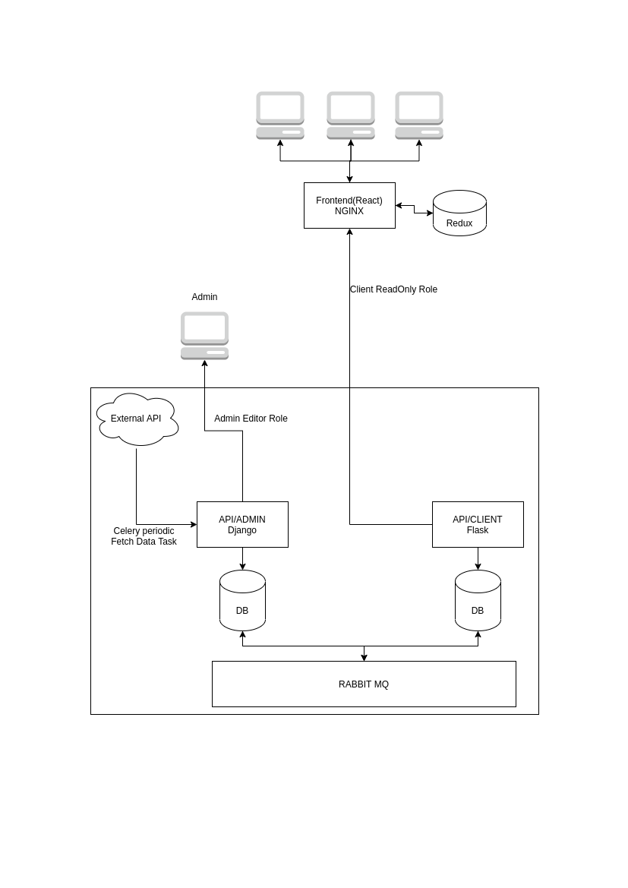

# QProject

This is a simple shopping App build with python web frameworks.

The Figma Design of this Shopping site is [here](https://www.figma.com/file/2BmSafYLLcd24YbfsTLNf8/QProject?node-id=0%3A1)


## Project Information


This project has two parts.

    - Backend
    - Frontend

    
## Architecture




## Backend
 
The Backend of the project is implemented by event driven Microservices.

From the Architecture we can see we have two Microservices. 

    - AdminSite
    Admin site is developed in Django web framework. Admin site have a periodic function which fetech data from a external api then save the data in 
    database. That periodic funtion will fetch data in between 6 Am to 6 pm. For communicate with other microservice I have used the rabbitmq's cloudmq free
    cloud hosted rabbitmq instance.


    - Client
    Client is responsible for sending product to the frontend. Client Microservice have a consumer function which consumes data which is send by the adminsite 
    through rabbitmq.

## Frontend
Frontend is build with reactjs and Reducer & Context hooks (Better Alternative of Redux). Frontend is also dockerized. Frontend consumes api data which is send
from the client microservice. So that if any incident happens in to the adminsite will not affect to the frontend. 


## Usage

*Make sure you have Docker & Docker-compose*


Clone this repo. Then navigate to the project folder.

### Start the AdminSite Microservice

```
    cd "project-folder-name"
    cd backend\adminsite
``` 
Now Open two window of terminal. (In one terminal type below commands)

```
    docker-compose up --build
```
Type this in another window.(Make sure you are in the same directory)

```
    $ docker-compose exec backend sh
    # python manage.py makemigrations && python manage.py migrate
```

### Start the Client Microservice

```
    cd "project-folder-name"
    cd backend\client
```
Now Open two window of terminal. (In one terminal type below commands)

```
    docker-compose up --build
```
Type this in another window.(Make sure you are in the same directory)

```    
    $ docker-compose exec backend sh
    # python manager.py db migrate && python manager.py db upgrade 
```
    
### Start the Frontend

``` cd "project-folder-name"
    cd frontend 
```
Now Open a window of terminal.

```
docker-compose up --build

```